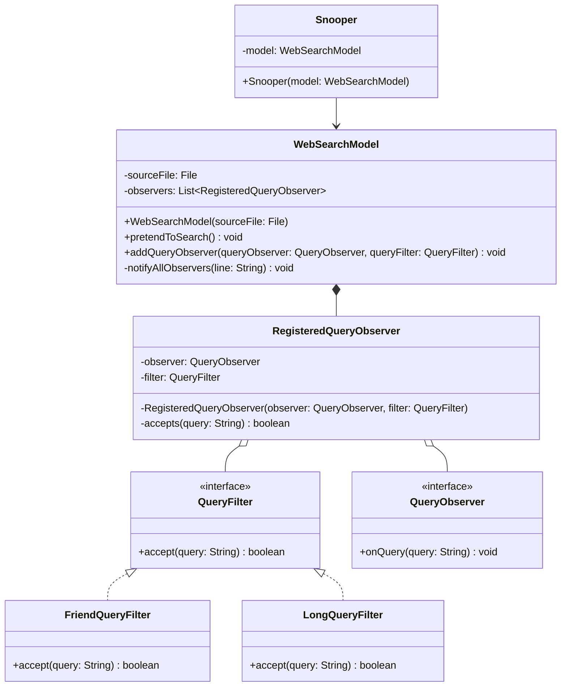

# Questão 1 - Lista 1 Padrões de Projeto OO
**Alunos:** Maria Letícia de Sousa Barboza e Caio Vinícius de Santana Gomes

Este repositório contém a solução para a lista de exercícios de Padrões de Projeto Orientados a Objetos, demonstrando a aplicação do padrão **Strategy** em conjunto com o padrão **Observer**.

## 📖 O Problema
O desafio consiste em adaptar um simulador de mecanismo de busca na Web, que originalmente notifica todos os observadores sobre todas as consultas realizadas. O objetivo é implementar filtros personalizados (por tamanho da consulta ou presença de palavras-chave) para que cada observador receba apenas as consultas que lhe interessam, extraindo essas consultas em tempo real, sem alterar a lógica principal do buscador.

## 🏗️ Modelagem da Solução

O projeto combina o padrão **Observer** (já presente para notificação de consultas) com o **Strategy** (adicionado para injetar as regras de filtro dinamicamente).

### Mapeamento do Padrão:
- **Strategy (`QueryFilter`):** A interface que define o contrato para os filtros. Contém um método que avalia e decide se uma consulta atende aos critérios para ser mostrada.
- **Concrete Strategies (`FriendQueryFilter`, `LongQueryFilter`):** As implementações específicas dos filtros. O filtro `FriendQueryFilter` verifica a presença da palavra "friend", enquanto o `LongQueryFilter` verifica se a consulta possui mais de 60 caracteres.
- **Context / Subject (`WebSearchModel`):** O modelo que lê os dados e notifica as consultas. Modificado para associar um `QueryFilter` ao registrar um observador, usando-o para validar se a notificação para aquele observador em específico deve ocorrer.
- **Client / Observer (`Snooper` / `Main`):** Configura os observadores (`Snooper`), associando a eles as estratégias de filtro específicas no momento de registrá-los no modelo de busca.

## 📊 Diagrama de Classes



## 🚀 Como Executar

O projeto não requer gerenciadores de dependência externos. Para compilar e rodar a simulação via terminal:

1. Navegue até o diretório raiz do projeto (`.../at1-java-pequisa-na-web`).
2. Compile os arquivos:
   ```bash
   javac websearch/*.java
   ```
3. Execute o programa:
   ```bash
   java websearch.Main
   ```